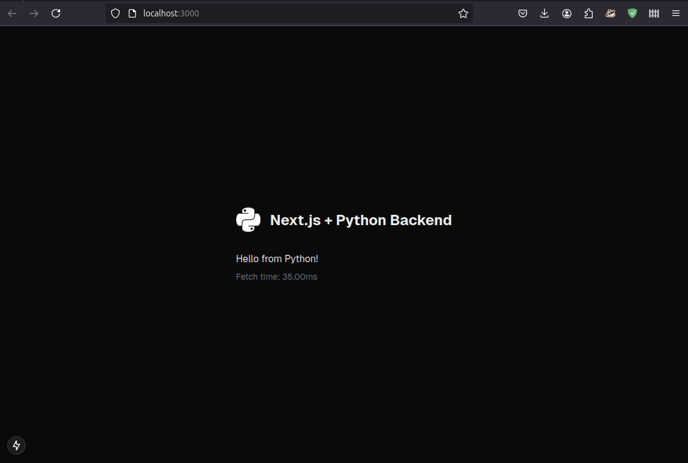

# Full-Stack Development: Next.js Frontend + Python Backend

## Environment Setup

### Create and Activate a Virtual Environment
Make sure to create a virtual environment (`venv`) before starting:

```bash
python -m venv .venv
source .venv/bin/activate  # Linux/Mac
.venv\Scripts\activate     # Windows
```

### Ensure These Tools are Accessible Inside Your `.venv`
- **Node.js**: Check installation with `node --version`.
- **npm**: Check with `npm --version`.
- **npx**: Check with `npx --version`.

---

## Step 1: Create a Next.js App

Run the following to create a TypeScript-based Next.js app inside your `.venv`:

```bash
npx create-next-app@latest sfront --typescript
```

This will generate a Next.js project (similar to React but more powerful).

### Start the Next.js App:
```bash
cd sfront
npm run dev
```
By default, the app runs on `http://localhost:3000`.

---

## Step 2: Python Backend Setup

### Required Python Libraries:
- **Flask**
- **Flask-CORS**

Install these using pip:

```bash
pip install flask flask-cors
```

---

## Step 3: Running the Frontend and Backend

### Split-Terminal Approach:
- Run the **Next.js frontend**:
  ```bash
  npm run dev
  ```
- Run the **Flask backend**:
  ```bash
  flask run
  ```

### Single-Script Approach (Optional):
Use threading in Python to run both servers simultaneously if needed.

---

## Key Notes:

### Ports:
- Default **Next.js frontend**: `http://localhost:3000`
- Default **Flask backend**: `http://127.0.0.1:5000`

### Flask-CORS:
Allows seamless communication between the frontend and backend.

---

## Advantages of this Stack

### Next.js:
- Exceptional at rendering/routing (even server-side).
- Convenient for building frontend and middleware.
- Works well with Tailwind for custom themes (e.g., dark/light mode).

### Python Backend:
- Powerful for heavy computations and backend tasks.
- Native support for SQLite for database needs.

### Performance:
- Sub-40ms response time for simple Python backend tasks.
- Leverages **JavaScript Workers** for rendering, computation, and communication.
- Easily pass heavy computational tasks to Python.

---

## Example Use Case

You can achieve **real-time video feed with image recognition** (e.g., YOLO model) in **less than 120 lines of code**. The backend processes data and streams results to the frontend.

- **Performance on a laptop**: Achieved 18 FPS for live image recognition!

---

### Screenshot:




---

Explore the limitless potential of combining the power of Next.js with Python!
