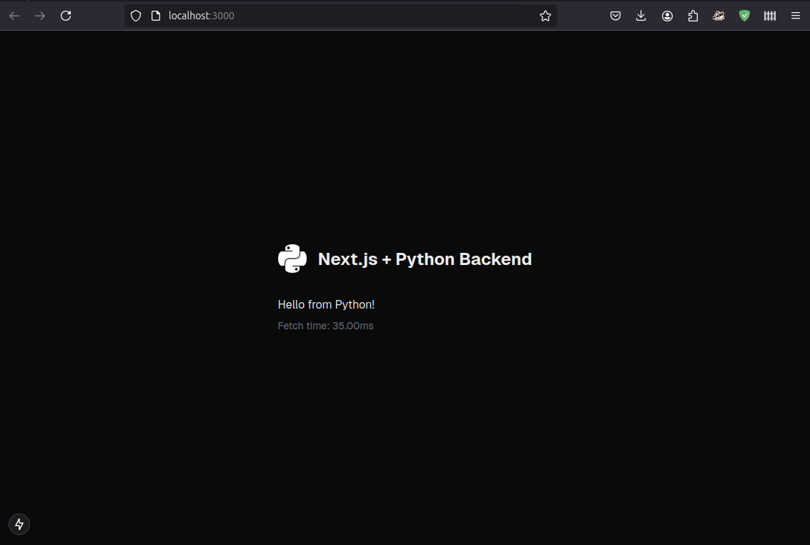

# Next.js + Python

## Environment Setup

### Create and Activate a Virtual Environment
Make sure to create a virtual environment (`venv`) before starting:

### Ensure These Tools are Accessible Inside Your `.venv`
- **Node.js**: Check installation with `node --version`.
- **npm**: Check with `npm --version`.
- **npx**: Check with `npx --version`.

---

## Step 1: Create a Next.js App

Run the following to create a TypeScript-based Next.js app inside your `.venv`:

```bash
npx create-next-app@latest sfront --typescript
```

This will generate a Next.js project, answer yes to all questions appart from custom alias @ 

### Start the Next.js App:
```bash
cd sfront
Then start editing page.tsx 
```
By default, the app runs on `http://localhost:3000`.

---

## Step 2: Python Backend Setup

### Required Python Libraries:
- **Flask**
- **Flask-CORS**

Install these using pip:

```bash
pip install flask flask-cors
```

---

## Step 3: Running the Frontend and Backend

### Split-Terminal Approach:
- Run the **Next.js frontend**:
  ```bash
  sudo npm run dev
  ```
- Run the **Flask backend**:
  ```bash
  sudo ./bin/python3 server.py
  ```
- Unsure on the specifics of other platforms :3

---

## Key Notes:

### Ports:
- Default **Next.js frontend**: `http://localhost:3000`
- Default **Flask backend**: `http://localhost:5000`

### Flask-CORS:
Allows communication between the frontend and backend.

### Screenshot:




---

## Project Structure

Here’s an overview of the directory structure and what each folder/file represents:

```
.
├── .venv/                 # Python virtual environment
│   ├── bin/               # Executables and scripts (Linux/Mac)
│   ├── include/           # C header files for compiling Python extensions
│   ├── lib/               # Python libraries and dependencies
│   ├── ...                # More python things

│   ├── sfront/            # Next.js frontend project (nested inside `.venv`)
│   │   ├── .next/         # Build output directory (generated during build basically cache)
│   │   ├── node_modules/  # JavaScript dependencies (managed by npm)
│   │   ├── public/        # Static assets like images, fonts, etc.
│   │   ├── src/           ### MAIN FRONT-END CODE
│   │   ├── package.json   # Project metadata and npm scripts
│   │   └── ...            # Other Next.js configuration files
│   └── ...                
├── requirements.txt       # Python dependencies for the backend
├── server.py              # MAIN BACKEND CODE > Can be linked to other files...
├── README.md              # Project documentation
└── ...                    # Other project-specific files
```

### Workflow:
- Develop the frontend inside `.venv/sfront`.
- Run and manage backend services via the `server.py` file.

---

## Advantages of this Stack

### Next.js:
- Exceptional at rendering/routing (even server-side).
- Convenient for building frontend and middleware.
- Works well with Tailwind for custom themes (e.g., dark/light mode).
- Can be made native using Electron runtime.

### Python Backend:
- Powerful for heavy computations and backend tasks.
- Native support for SQLite for database needs.
- Built-in most devices

### Performance:
- Sub-40ms response time for simple Python backend tasks.
- Can leverage JS workers for rendering, communication and even light-weight computational. 
- Easily pass heavy computational tasks to Python.

---

## Example Use Case

You can achieve **real-time video feed with image recognition** (e.g., YOLO model) in **less than 120 lines of code**. The backend processes data and streams results to the frontend.

- **Performance on a laptop**: Achieved 18 FPS for live image recognition, YOLOv8 with Standard dataset.
- No multi-threading, no GPU. 

